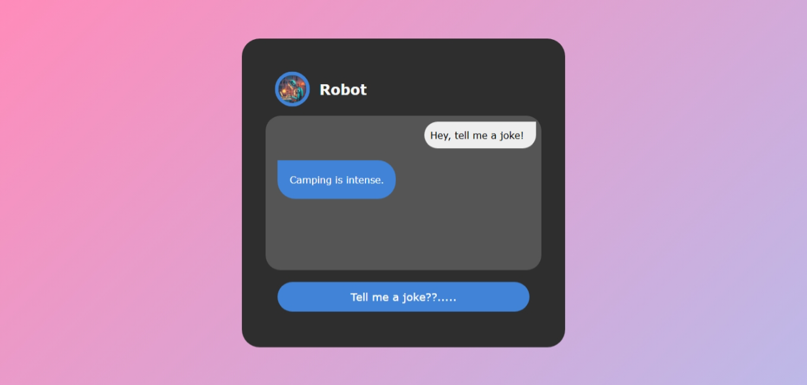
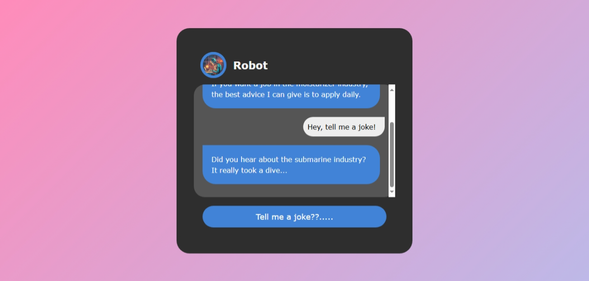

# 🤖 Robo Joke Generator

A fun and interactive web app where a robot tells you random jokes with a click of a button. Built using HTML, CSS, and JavaScript, and powered by the [icanhazdadjoke API](https://icanhazdadjoke.com/).

---

## 🔗 Live Demo

👉 [Click here to try it now](https://msdhinesh45.github.io/Robo-joke-generator/)

> *(Replace the above link with your actual GitHub Pages or live hosting link)*

---

## 🖼️ Output Screenshots

### 💬 Output 1:

### 🤖 Output 2:

---

## 🚀 Features

- Robot avatar with animation
- Stylish chat interface with gradients and shadows
- Random jokes using public API
- Fully responsive design
- Smooth animations and button interactions

---

---

## 🛠️ Tech Stack

- HTML5
- CSS3 (with custom properties, flexbox, keyframe animations)
- JavaScript (DOM manipulation, fetch API)
- [icanhazdadjoke API](https://icanhazdadjoke.com/)

---

## 📦 How to Use Locally

1. Clone or download the repo.
2. Open the folder in your code editor.
3. Make sure all files (`index.html`, `styles.css`, `script.js`, image files) are in the same directory.
4. Open `index.html` in a browser.
5. Click the joke button and laugh out loud!

---

## 📸 Avatar Image

Make sure to include a robot image named `roboat image.png` in your project directory. You can replace it with your custom bot image if you like.

---

## 🙋 Author

**Dhinesh Kumar**  
Frontend Intern @ Senchola | B.Sc IT | M.Sc CS (Pursuing)  
🌐 GitHub: [@msdhinesh45](https://github.com/msdhinesh45)

---

## 📄 License

This project is open-source and free to use for learning or personal use. No license required.

---

✨ *Made with love and humor.*

